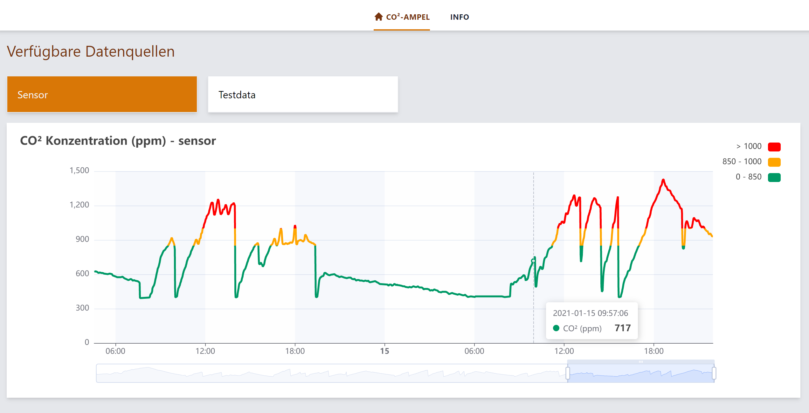
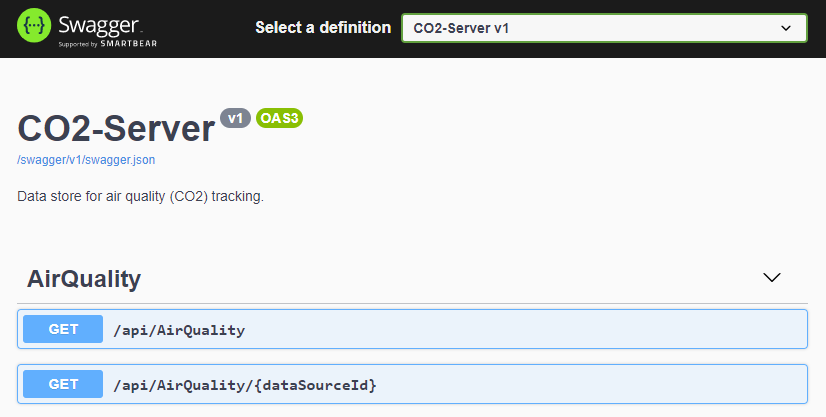
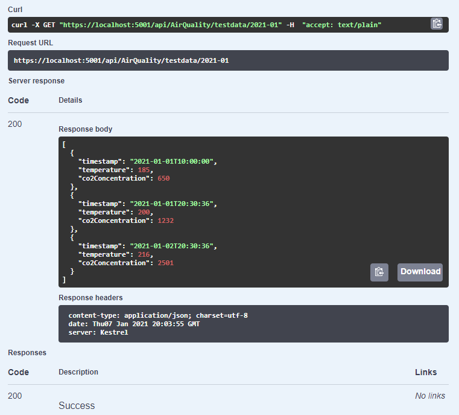

# CO² Server

Dieses Repo beinhaltet einen Server zur zentralen Speicherung und Anzeige der Daten einer oder mehrerer [CO²-Ampeln](https://github.com/ramdacxp/co2-ampel).

Der Server ist in .Net Core entwickelt und unter Windows und Linux lauffähig. Für Windows und Raspberry Pi stehen Docker Images zur Verfügung. Daten werden in CSV-Dateien gespeichert.


## Software selbst kompilieren

Benötigte Software unter Windows 10:

* [Git](https://git-scm.com/downloads)
* [Visual Studio Code](https://code.visualstudio.com/)
* [.NET SDK](https://dotnet.microsoft.com/download) ([Version 5.0-101](https://dotnet.microsoft.com/download/dotnet/thank-you/sdk-5.0.101-windows-x64-installer) oder neuer)

Weitere Tools werden automatisch als VS Code Erweiterungen installiert, sobald der Root-Ordner dieses Repositories in Visual Studio geladen wurde:

* Git, VSCode und das SDK müssen installiert sein
* Windows Eingabeaufforderung öffnen (z.Bsp. mit `[Win]-R`, `cmd`, `[Enter]`)
* In den Ordner wechseln, der Code-Repositories enthalten soll (z.Bsp. `Source\Repos`) und dieses Repo mit Git klonen:

  ```cmd
  cd 
  mkdir Source\Repos
  cd Source\Repos
  git clone https://github.com/ramdacxp/co2-server.git
  cd co2-ampel
  ```

* In den neu angelegten Ordner wechseln und diesen in Visual Studio Code öffnen (`File > Open Folder ...` oder auf der Kommandozeile mit `code .`)
* Die vorgeschlagenen Erweiterungen installieren
* Das Projekt übersetzen mit `Terminal > Run Build Task...`

## Server starten

Der Server kann in VS Code gestartet werden mit `Run > Start Debugging`
oder alternativ auf der Kommandozeile durch Ausführen von `dotnet run`
im Unterordner `server`.

```cmd
C:\Users\Mischa\Source\Repos\co2-server\server>dotnet run
Building...
info: Microsoft.Hosting.Lifetime[0]
      Now listening on: https://localhost:5001
info: Microsoft.Hosting.Lifetime[0]
      Now listening on: http://localhost:5000
info: Microsoft.Hosting.Lifetime[0]
      Application started. Press Ctrl+C to shut down.
info: Microsoft.Hosting.Lifetime[0]
      Hosting environment: Development
info: Microsoft.Hosting.Lifetime[0]
      Content root path: C:\Users\Mischa\Source\Repos\co2-server\server
```

Nach dem Start ist der Server unter folgenden Adressen erreichbar (mit und ohne Verschlüsselung):

* <https://localhost:5001/>
* <http://localhost:5000/>

Der Server kann mit der Tastenkombination `Strg-C` beendet werden.

## Web-API

Die CO²-Server Web-API bietet Methoden zum **Hinzufügen und Abfragen von AirQuality Daten**. Ein Löschen von Daten ist nicht möglich.

Es werden mehrere **Datenquellen** (`DataSource`) unterstützt. Eine Datenquelle identifiziert einen Sensor eindeutig. Eine `dataSourceId` ist ein Text bestehend aus Kleinbuchstaben, Ziffern, Minus oder Unterstrich. Es können die Ids aller vorhandenen Datenquellen abgefragt werden.

Pro Datenquelle werden mehrere **Datenpakete** (`DataPackage`) unterstützt. Ein Datenpaket enthält für eine bestimmte Datenquelle die Sensordaten eines Monats. Die `dataPackageId` ist ein Text im Format `JJJJ-MM` für Jahr und Monat. Es können die Ids aller vorhandenen Datenpakete für eine bestimmte Datenquelle abgefragt werden.

Pro Datenquelle und DatenPaket kann eine Liste der vorhandenen **AirQuality Daten** abgefragt werden.

| Feld             | Typ                            | Beschreibung                                                                                   |
|------------------|--------------------------------|------------------------------------------------------------------------------------------------|
| timestamp        | DateTime (YYYY-MM-DDTHH:MM.SS) | Zeitpunkt der Messung in lokaler Zeit                                                          |
| temperature      | Ganzzahl (1/10 Grad Celsius)   | Temperatur zum Messzeitpunkt in 1/10 C; z.Bsp. 236 für 23,6°C                                  |
| co2Concentration | Ganzzahl (ppm)                 | CO² Konzentration in der Umgebungsluft in PPM (Parts per Million); typischer Weise 400 .. 5000 |

Zum **Hinzufügen** von Daten muss eine `dataSourceId` zusammen mit einem AirQuality Datensatz übergeben werden. Notwendige Datenquellen und Datenpakete werden automatisch erstellt, wenn nötig.

## Swagger

Unter der Adresse <http://localhost:5000/swagger/> ist ein Swagger UI zum Testen der zur Verfügung gestellten Web API erreichbar.



Der Server enthält einen Testdatensatz mit der `dataSourceId` "`testdata`".



## Verwendung mit Docker

Dieses Repository enthält Dockerfiles und Hilfsscripte (`docker-xxx.cmd`) zur Erzeugung von Docker Images und zum Starten des CO²-Servers aus Docker Containern. Bei Verwendung dieser Images müssen neben Docker keine weiteren Tools oder SDKs installiert werden.

Es kommen Linux Docker Images zum Einsatz. Diese stehen für die Architekturen **AMD64** (für Linux und Window) und **ARM** (für Raspberry PI 3 oder neuer) im [Docker Hub](https://hub.docker.com/r/ramdac/co2-server) zur Verfügung:

<https://hub.docker.com/r/ramdac/co2-server>

* AMD64 für Windows/Linus: `docker pull ramdac/co2-server`
* ARM für Raspberry Pi: `docker pull ramdac/co2-server:arm`

### Windows 10 WSL2

Zur Verwendung unter Windows 10 wird **Docker Desktop** ab Version 3 mit aktivierter Unterstützung für WSL2 (Windows Subsystem für Linux) benötigt.

* [Installationsanleitung](https://docs.docker.com/docker-for-windows/install/)
* [Docker Desktop WSL2](https://docs.docker.com/docker-for-windows/wsl/)

Über `docker-run.cmd` kann der Container **testweise** gestartet werden. Der CO2-Server ist dann unter Port 1234 über die Adresse <http://localhost:1234/> erreichbar. Wird der Server mit `Strg-C` beendet, wird der Container heruntergefahren und **inkl. aller evtl. erzeugen Daten gelöscht**.

Durch Mappen des Daten Ordners `App_Data` auf einen lokalen Ordner außerhalb des Docker Containers oder durch Verwendung eines Volumes können die Daten über Containerneustarts und -updates hinweg erhalten werden.

Ausgewählte Docker-Befehle:

* Starten des CO2-Servers mit Port-Weiterleitung auf 1234 (<http://localhost:1234/>):  
  `docker run -p 1234:80 -it --rm ramdac/co2-server`
* Starten einer Unix Kommandozeile (bash) im Docker Container. Hiermit kann das Dateisystem des Containers untersucht werden, z.Bsp. der Inhalt des Ordners `/app/App_Data`:  
  `docker run -p 1234:80 -it --rm --entrypoint bash ramdac/co2-server`

### Raspberry Pi

Das folgende Shellscript startet den CO2-Server auf dem Raspberry Pi im Hintergrund.

* Der zugehörige Docker Container hat den Namen `co2server` und kann über diesen gestartet und gestoppt werden.
* Der Server ist über den Rechnernamen des Raspberry Pi auf Port 4444 verfügbar.
* Die Daten werden außerhalb des Docker Containers im gemappten Verzeichnis `~/docker/co2server` abgelegt. Hierbei ist `~` das Homeverzeichnis des Docker Users. Das Verzeichnis muss vor dem Start des Containers angelegt worden sein und der Docker-User benötigt Schreibrechte.  
  **Achtung:** Eine CO2-Ampel sendet relativ oft Daten zum Server, was entsprechend viele Schreibzugriffe zur Folge hat und die Lebensdauer der SD-Speicherkarte des Raspberry Pi verringern kann. Eine mögliche Lösung wäre die Verwendung eines Samba-Fileshares als Datenspeicherordner.

```bash
#!/bin/bash

docker container stop co2server
docker container rm co2server
docker pull ramdac/co2-server:arm

docker run -d \
  --name co2server \
  -p 4444:80 \
  -v ~/docker/co2server:/app/App_Data \
  --restart unless-stopped \
  ramdac/co2-server:arm
```

## Links

* Repo der passenden [CO²-Ampel](https://github.com/ramdacxp/co2-ampel)
* [Der CO2-Warner für die Schule](https://www.heise.de/select/make/2020/5/2022015381334973804) im [Make: Magazin 5/2020](https://www.heise.de/select/make/2020/5)
* [CVS Helper](https://github.com/JoshClose/CsvHelper)

## Lizenz

[MIT License](LICENSE)
