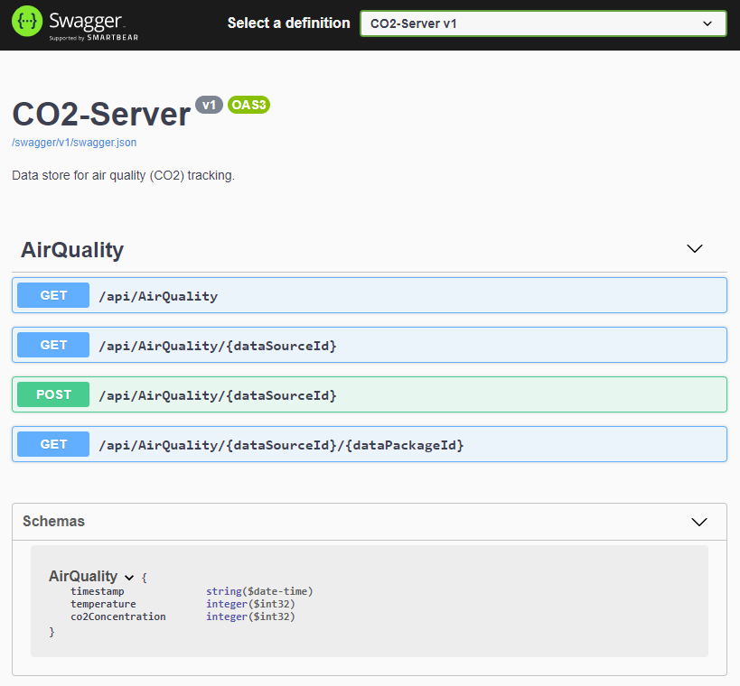

# CO² Server

Dieses Repo beinhaltet einen Server zur zentralen Speicherung und Anzeige der Daten einer oder mehrerer [CO²-Ampeln](https://github.com/ramdacxp/co2-ampel).

Der Server ist in .Net Core entwickelt und unter Windows und Linux lauffähig. Für Windows und Raspberry Pi stehen Docker Images zur Verfügung. Daten werden in CSV-Dateien gespeichert.

## Software selbst compilieren

Benötigte Software unter Windows 10:

* [Visual Studio Code](https://code.visualstudio.com/)
* [Git](https://git-scm.com/downloads)

Weitere Tools werden automatisch als VS Code Plugins installiert, sobald der Root-Ordner dieses Repositories in Visual Studio geladen wurde:

* VSCode und Git müssen installiert sein
* Windows Eingabeaufforderung öffnen (z.Bsp. mit `[Win]-R`, `cmd`, `[Enter]`)
* In den Ordner wechseln, der Code-Repositories enthalten soll (z.Bsp. `Source\Repos`) und dieses Repo mit Git clonen:

  ```cmd
  cd 
  mkdir Source\Repos
  cd Source\Repos
  git clone https://github.com/ramdacxp/co2-server.git
  cd co2-ampel
  ```

* In den neu angelegten Ordner wechseln und diesen in Visual Studio Code öffnen (`File > Open Folder ...` oder auf der Kommandozeile mit `code .`)
* Die vorgeschlagenen Erweiterungen installieren
* Das Projekt übersetzen mit `Terminal > Run Build Task...`

## Server starten

Der Server kann in VS Code gestartet werden mit `Run > Start Debugging`
oder alternativ auf der Kommandozeile durch Ausführen von `dotnet run`
im Unterordner `Server`.

```cmd
C:\Users\Mischa\Source\Repos\co2-server\Server>dotnet run
Building...
info: Microsoft.Hosting.Lifetime[0]
      Now listening on: https://localhost:5001
info: Microsoft.Hosting.Lifetime[0]
      Now listening on: http://localhost:5000
info: Microsoft.Hosting.Lifetime[0]
      Application started. Press Ctrl+C to shut down.
info: Microsoft.Hosting.Lifetime[0]
      Hosting environment: Development
info: Microsoft.Hosting.Lifetime[0]
      Content root path: C:\Users\Mischa\Source\Repos\co2-server\Server
```

Nach dem Start ist der Server unter folgenden Adressen erreichbar (mit und ohne Verschlüsselung):

* <https://localhost:5001/>
* <http://localhost:5000/>



Der Server kann mit der Tastenkombination `Strg-C` beendet werden.

## Verwendung von Docker

Todo

## Links

* Repo der passenden [CO²-Ampel](https://github.com/ramdacxp/co2-ampel)
* [Der CO2-Warner für die Schule](https://www.heise.de/select/make/2020/5/2022015381334973804) im [Make: Magazin 5/2020](https://www.heise.de/select/make/2020/5)
* [CVS Helper](https://github.com/JoshClose/CsvHelper)

## Lizenz

[MIT License](LICENSE)
